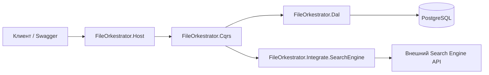

# FileOrkestrator

HTTP API **оркестратора индексации**: регистрация логических источников данных, постановка задач индексации во **внешний Search Engine**, отслеживание статуса, отмена и поиск по строке. Состояние хранится в **PostgreSQL**; миграции EF Core применяются при старте приложения.

---

## Архитектура



- **Host** — ASP.NET Core, контроллеры, Swagger, глобальная обработка ошибок (Problem Details), **API key** для путей `/api/...`, конфигурация (в т.ч. user secrets и приоритет JSON над секретами).
- **CQRS** — MediatR: команды и запросы (handlers в одной сборке с контрактами).
- **Dal** — EF Core `FileOrkestratorDbContext`, сущности `IndexingSource`, `IndexingJob`.
- **Dto** — контракты тел запросов/ответов API (без зависимостей от домена приложения).
- **Domain** — перечисления и модели предметной области (статусы и т.д.).
- **Abstractions** — общие исключения и коды ошибок (`OrchestratorException`, `ErrorCode`).
- **Integrate.SearchEngine** — Refit-клиент к OpenAPI внешнего Search Engine, опционально **mock** при `SearchEngine:IsTest = true`.
- **Migrator** — сборка с миграциями EF; подключается из Dal через `MigrationsAssembly`.

Поток данных: клиент вызывает API оркестратора → handler читает/пишет БД → при необходимости вызывает Search Engine → ответ маппится в DTO.

---

## Проекты решения

| Проект | Назначение |
|--------|------------|
| **FileOrkestrator.Host** | Точка входа: `Program.cs`, контроллеры, аутентификация по API key, Swagger, конфигурация. |
| **FileOrkestrator.Cqrs** | Команды/запросы MediatR и обработчики: источники, индексация, поиск. |
| **FileOrkestrator.Dal** | DbContext, сущности EF, регистрация PostgreSQL. |
| **FileOrkestrator.Dto** | DTO входа/выхода HTTP API. |
| **FileOrkestrator.Domain** | Доменные типы (например `OrchestrationJobStatus`). |
| **FileOrkestrator.Abstractions** | Коды ошибок и `OrchestratorException`. |
| **FileOrkestrator.Integrate.SearchEngine** | `ISearchEngineClient`, Refit, mock для тестов/разработки. |
| **FileOrkestrator.Migrator** | Миграции EF Core и snapshot. |
| **FileOrkestrator.Cqrs.Tests** | Юнит-тесты CQRS (InMemory EF + Moq). |

---

## Базовый URL API

Префикс маршрутов: **`/api/orkestrator/v1/...`**

Для всех запросов к **`/api/...`** требуется заголовок API key (см. ниже).

---

## Аутентификация оркестратора (API key)

Если **`ApiAuthentication:ApiKey`** не пустой, для путей **`/api/**`** проверяется заголовок:

| Параметр конфигурации | Значение в текущем `appsettings.json` |
|------------------------|----------------------------------------|
| `ApiAuthentication:HeaderName` | `X-API-Key` |
| `ApiAuthentication:ApiKey` | `01445ccc-521d-4f72-8cb9-0dbbf92a8c59` |

Пример:

```http
GET /api/orkestrator/v1/search?q=test HTTP/1.1
Host: localhost:8080
X-API-Key: 01445ccc-521d-4f72-8cb9-0dbbf92a8c59
```

**Важно:** для вызовов **внешнего Search Engine** используется отдельная секция **`SearchEngine`** (в т.ч. `SearchEngine:ApiKey` в заголовке к внешнему сервису). Это не то же самое, что ключ доступа к API оркестратора.

Текущие значения из конфига:

| Ключ | Значение в `appsettings.json` |
|------|-------------------------------|
| `SearchEngine:BaseUrl` | `https://localhost:5001` |
| `SearchEngine:RequestTimeout` | `00:01:00` |
| `SearchEngine:ApiKey` | `01445ccc-521d-4f72-8cb9-0dbbf92a8c59` |
| `SearchEngine:IsTest` | `true` (in-memory mock Search Engine, без реального HTTP) |

В продакшене ключи и строки подключения лучше задавать через **переменные окружения**, **user secrets** или секреты оркестратора, а не хранить в репозитории.

---

## HTTP API: методы, логика, входы и DTO

### Источники — `SourcesController`

Базовый путь: **`/api/orkestrator/v1/sources`**

#### `POST /api/orkestrator/v1/sources`

Регистрация источника данных для индексации.

| | |
|--|--|
| **Вход** | Тело JSON: `RegisterSourceInput` |
| **Логика** | Обрезка `Name`; если пусто — ошибка валидации. Создаётся `IndexingSource`, сохраняется в БД. |
| **Выход** | `RegisterSourceDto`: `Id`, `Name` |

**`RegisterSourceInput`**

| Поле | Тип | Описание |
|------|-----|----------|
| `Name` | `string` | Имя источника; после trim не должно быть пустым. |

**`RegisterSourceDto`**

| Поле | Тип | Описание |
|------|-----|----------|
| `Id` | `Guid` | Идентификатор источника. |
| `Name` | `string` | Сохранённое имя. |

---

#### `POST /api/orkestrator/v1/sources/{sourceId}/index`

Запуск индексации по источнику.

| | |
|--|--|
| **Вход** | `sourceId` в пути; тело опционально: `StartIndexingInput` |
| **Логика** | Проверка существования источника. При совпадении `IdempotencyKey` с ранее созданной задачей для того же источника возвращается та же задача (`IsDuplicate: true`) без повторного вызова Search Engine. Иначе создаётся `IndexingJob`, вызывается `StartIndexJob`, затем опрос статуса и сохранение в БД. При ошибке Search Engine задача помечается как Failed. |
| **Выход** | `StartIndexingDto` |

**`StartIndexingInput`** (все поля опциональны)

| Поле | Тип | Описание |
|------|-----|----------|
| `FilePaths` | `string[]` | Пути к файлам; если пусто — полная переиндексация источника. |
| `IdempotencyKey` | `string` | Ключ идемпотентности повторных запусков. |
| `CorrelationId` | `string` | Сквозной идентификатор для логов. |

**`StartIndexingDto`**

| Поле | Тип | Описание |
|------|-----|----------|
| `JobId` | `Guid` | Локальный id задачи. |
| `ExternalJobId` | `string` | Id задачи у Search Engine. |
| `Status` | `string` | Строковый статус (как в БД). |
| `AcceptedAtUtc` | `DateTimeOffset` | Время принятия у Search Engine. |
| `IsDuplicate` | `bool` | Повтор по идемпотентности. |

---

### Задачи индексации — `JobsController`

Базовый путь: **`/api/orkestrator/v1/jobs`**

#### `GET /api/orkestrator/v1/jobs/{jobId}`

Актуальный статус задачи.

| | |
|--|--|
| **Вход** | `jobId` (guid) |
| **Логика** | Загрузка задачи. Если нет `ExternalJobId` — ответ только из БД. Иначе опрос Search Engine, обновление строки в БД, маппинг в DTO. |
| **Выход** | `JobStatusDto` |

**`JobStatusDto`**

| Поле | Тип | Описание |
|------|-----|----------|
| `JobId`, `SourceId` | `Guid` | Идентификаторы. |
| `ExternalJobId` | `string` | Id у Search Engine. |
| `Status` | `string` | Статус. |
| `Progress` | `float?` | 0…1. |
| `IndexedCount`, `FailedCount` | `int` | Счётчики. |
| `LastError` | `string` | Текст ошибки. |
| `StartedAtUtc`, `CompletedAtUtc` | `DateTimeOffset?` | Временные метки. |
| `PartialSuccess` | `bool` | Частичный успех. |

---

#### `DELETE /api/orkestrator/v1/jobs/{jobId}`

Запрос отмены задачи.

| | |
|--|--|
| **Вход** | `jobId` |
| **Логика** | Нельзя отменить в терминальных статусах (успех, ошибка, отмена). Если есть `ExternalJobId`, вызывается отмена у Search Engine. Локально статус — Cancelled. |
| **Выход** | `true` (тело `bool`) |

---

### Поиск — `SearchController`

Базовый путь: **`/api/orkestrator/v1/search`**

#### `GET /api/orkestrator/v1/search?q=...&skip=&take=`

Полнотекстовый поиск (прокси к Search Engine).

| | |
|--|--|
| **Вход** | `q` — строка запроса (обязательна после trim); `skip`, `take` — пагинация. |
| **Логика** | Пустой `q` — ошибка валидации. Иначе вызов `SearchAsync` у клиента Search Engine и маппинг в DTO. |
| **Выход** | `SearchDocumentsDto` |

**`SearchDocumentsDto`**

| Поле | Тип | Описание |
|------|-----|----------|
| `Items` | `SearchHitDto[]` | Страница результатов. |
| `TotalCount` | `long` | Общее число совпадений. |

**`SearchHitDto`**

| Поле | Тип | Описание |
|------|-----|----------|
| `DocumentId` | `string` | Id документа. |
| `Title`, `Snippet` | `string` | Заголовок и сниппет. |
| `Score` | `double?` | Релевантность. |
| `SourcePath` | `string` | Путь к источнику. |

---

### Корень сайта

- **`GET /`** — в среде **Development** редирект на **`/swagger`**; иначе краткий JSON с указанием базового пути API.

---

## Ошибки

Ошибки домена и валидации возвращаются как **Problem Details** (`application/problem+json`), в расширениях часто есть поле `code` (`ErrorCode`) и `traceId`.

---

## Запуск локально (без Docker)

1. Поднимите PostgreSQL и задайте строку **`ConnectionStrings:PostgreSQL`** (например в `appsettings.Development.json` или user secrets).
2. Из каталога с решением:

```bash
dotnet run --project FileOrkestrator.Host/FileOrkestrator.Host.csproj
```

По умолчанию Kestrel слушает URL из launchSettings / конфига (часто `http://localhost:5xxx`). Swagger в Development: `/swagger`.

---

## Docker: одна команда

В каталоге, где лежат **`Dockerfile`** и **`docker-compose.yml`**:

```bash
docker compose up --build
```

Поднимается:

- **PostgreSQL** (порт **5432**, БД `file_orkestrator`, пользователь `postgres`, пароль `admin`);
- **приложение** на порту **8080** (`http://localhost:8080`).

Переменные окружения в `docker-compose.yml` задают те же параметры, что и в текущих конфигах (включая API key и Search Engine); строка подключения использует хост **`postgres`** внутри сети Compose.

Остановка: `Ctrl+C`, затем при необходимости:

```bash
docker compose down
```

Удалить и том с данными БД: `docker compose down -v`.

---

## Тесты

```bash
dotnet test
```

Проект: **FileOrkestrator.Cqrs.Tests** (xUnit, InMemory EF, Moq).
